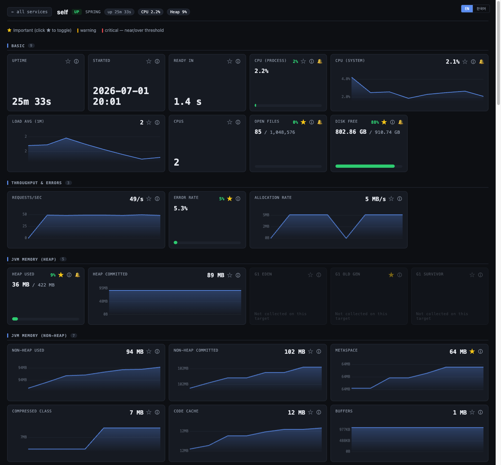

# Ticker — service liveness board & Spring Boot / JVM metrics dashboard

**Ticker is a lightweight, self-hosted liveness board for Spring Boot apps, nginx, and any HTTP
endpoint — with a rich, curated drill-down into JVM & actuator metrics and simple Slack alerting.**
Think "the Spring Boot Admin view you actually wanted to look at": one status wall, one click to a
full JVM dashboard, and alerts that don't spam you.

It's a **single Spring Boot app** (Kotlin + Web MVC) that serves a bundled React UI. No database
required — current state is kept in memory and self-heals across restarts via a client heartbeat.
Persisted metric history (H2 / MySQL / PostgreSQL) is **opt-in**.

[](LICENSE)




## What it is (and is not)

Ticker is a **liveness board + a fixed, server-curated JVM/actuator dashboard** — deliberately *not*
an observability platform. It is **not** a replacement for Prometheus / Grafana / Datadog, has no
query language, and is not a drag-and-drop dashboard builder. The drill-down is a comprehensive but
**curated** set of widgets; the goal is "is my service alive, and if it's unhealthy, what's wrong"
at a glance — not arbitrary-metric exploration.

> Not (yet) the sole alerting path for production payment flows. Run it *alongside* your existing
> on-call alerting until proven — see [Guardrails](#guardrails-fintech).

## Features

- **Status wall** — every service as a live tile (UP / DEGRADED / DOWN / UNKNOWN), colour + glyph +
  label (not colour alone). `DOWN` only after N consecutive failed polls (debounced).
- **Full JVM / actuator drill-down** — 15 groups / ~90 curated widgets: CPU, heap & non-heap pools,
  GC (full vs minor, overhead, heap-after-GC), threads, classes, HTTP server & client, Tomcat,
  HikariCP / JDBC, JPA/Hibernate, caches, scheduled tasks, logback. Metrics a target doesn't expose
  are shown **dimmed** ("not collected"), so you can see at a glance what each app emits.
- **Per-metric ★ favourites + value-driven severity** — star the signals you care about; the
  card's bar turns amber/red as a value nears/breaches its alert threshold (or a gauge's max).
- **Two kinds of alerting** — incident (event-driven DOWN/recovery, with cooldown) and
  metric-threshold rules (per-metric, UI- or code-configurable), dispatched to **Slack** or logged.
- **Opt-in persisted history** — H2 (embedded file, zero-setup) / MySQL / PostgreSQL via Spring JDBC,
  with server-side downsampled range queries (5m–7d), retention pruning, and **archive-before-prune**
  to cold storage (guardrail #5).
- **Add monitors from the UI or from code** — a plain HTTP endpoint from the wall, or targets /
  alert rules from a `TickerConfigurer` bean. Static `targets.yml` also works.
- **i18n** — Korean / English, switchable top-right.
- **Single Docker image** — Spring Boot serves the built React assets; Java 21, virtual threads on.

## Quick start

Ticker ships as two Spring Boot starters (published under `io.stevelabs`, Apache-2.0). Until they're
on Maven Central, `./gradlew publishToMavenLocal` installs them to `~/.m2`.

### 1. Run a collector

Add the **server** starter to a Spring Boot app and enable it:

```kotlin
// build.gradle.kts
dependencies {
    implementation("io.stevelabs:ticker-server-spring-boot-starter:0.1.0")
}
```
```yaml
# application.yml
ticker:
  server:
    enabled: true
  targets:                       # optional static targets (things that can't self-register)
    - { name: edge-nginx, type: HTTP, url: http://edge-nginx/healthz }
```

Start it and open `http://localhost:8080` — the status wall + bundled UI are served by the app.

### 2. Let your services self-register (push)

Add the **client** starter to each monitored Spring Boot app — it only needs the collector URL:

```kotlin
dependencies {
    implementation("io.stevelabs:ticker-client-spring-boot-starter:0.1.0")
}
```
```yaml
ticker:
  client:
    enabled: true
    collector-url: http://ticker-collector:8080
```

No client? Add a plain **HTTP monitor from the wall** (name + URL), or a target in `targets.yml`, or
from code (below).

### 3. (Optional) configure in code

```kotlin
@Bean
fun tickerConfig() = TickerConfigurer { t ->
    t.addTarget("payments-api", ServiceType.HTTP, "https://payments/health", tags = listOf("prod"))
    t.configureAlert("cpu-process", threshold = 0.70, forSeconds = 15)
}
```

## Configuration reference

All properties are `@ConfigurationProperties` with IDE hints; off-by-default beyond the basics.

| Property | Default | Notes |
|---|---|---|
| `ticker.server.enabled` | `true` | Activate the collector + UI. |
| `ticker.poll.interval` | `10s` | How often targets are polled (virtual-thread fan-out). |
| `ticker.poll.failure-threshold` | `3` | Consecutive failures before `DOWN` (debounce). |
| `ticker.alert.enabled` | `false` | Metric-threshold alerting. |
| `ticker.alert.slack-webhook-url` | — | Slack incoming webhook (**env only**, never commit). |
| `ticker.history.enabled` | `false` | Opt-in persisted metric history. |
| `ticker.history.db` | `H2` | `H2` (embedded file) · `MYSQL` · `POSTGRESQL`. |
| `ticker.history.retention` | `7d` | Hourly prune drops samples older than this. |
| `ticker.history.archive.enabled` | `false` | Archive-before-prune to gzip CSV (guardrail #5). |

DB credentials come from the environment only (`ticker.history.username` / `password`). For
MySQL/PostgreSQL the schema auto-creates from the bundled `classpath:db/ticker-history-schema-<db>.sql`,
or a DBA can pre-provision it (`init-schema=false`). See
[`docs/ARCHITECTURE.md`](docs/ARCHITECTURE.md) for the full config surface, history sizing/backup, and
restore commands.

## Guardrails (fintech)

Ticker is built for internal fintech use; these are non-negotiable:

1. **Watch the watcher.** A dead collector must be detectable from *outside* it. The collector
   exposes its own `/actuator/health` — **you must add an external check** (a k8s liveness probe
   *and* one outside ping). "No alert" must never be trusted as "all healthy."
2. **Debounce alerts.** Never alert on a single failed poll (N-consecutive + cooldown).
3. **Not the sole alert path (yet).** Run alongside existing on-call alerting.
4. **Pull only whitelisted data.** Polling fetches only health + an explicit metric whitelist —
   never `env`, `configprops`, or `heapdump`.
5. **Archive before delete; secrets out of properties.** History archival writes + verifies cold
   storage before deleting rows; Slack/DB credentials come from env only.

## Build & run

```bash
npm --prefix frontend run build          # build the React UI
./gradlew :ticker-server-sample:bootRun  # run a demo collector (in-memory) on :8080
./gradlew test jacocoTestReport          # tests + coverage
./gradlew :ticker-server-sample:bootBuildImage   # → ticker:latest Docker image
```

## Tech stack

Kotlin · Spring Boot 4 (Web MVC) · Java 21 + virtual threads · React + TypeScript + Vite (uPlot
charts) · Spring JDBC + H2/MySQL/PostgreSQL (opt-in) · Gradle (Kotlin DSL) · Apache-2.0.

## Docs

- [`docs/ARCHITECTURE.md`](docs/ARCHITECTURE.md) — components, API, data model, history, alerting
- [`docs/ROADMAP.md`](docs/ROADMAP.md) — phased build plan
- [`docs/PRD.md`](docs/PRD.md) — product scope & UX direction
- Project page: **https://stevelabs.io/ticker**

## Status & contributing

Ticker is a **personal, solo-maintained** open-source project — public so you
can run it, read it, and fork it, but **not accepting pull requests**. Bug
reports are welcome; features outside [`docs/ROADMAP.md`](docs/ROADMAP.md) are
usually out of scope by design. Want it to do more? Fork it — that's what
Apache-2.0 is for. Details in [`CONTRIBUTING.md`](CONTRIBUTING.md).

## License

[Apache License 2.0](LICENSE) © SteveLabs.
