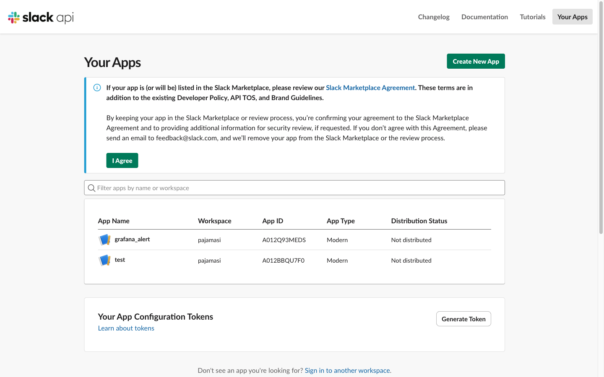
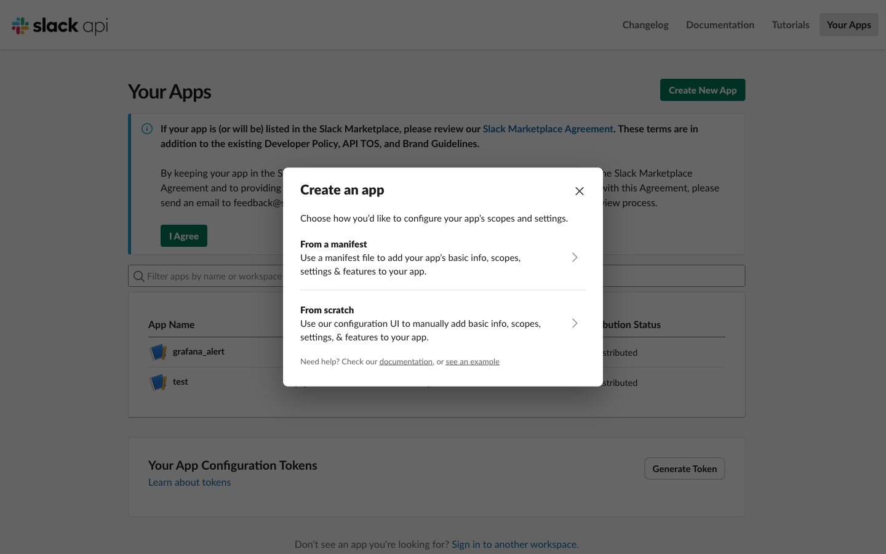
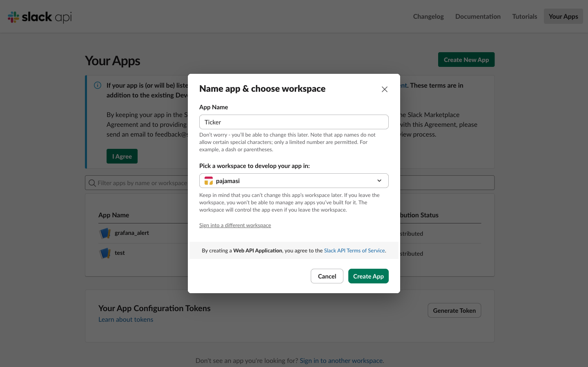
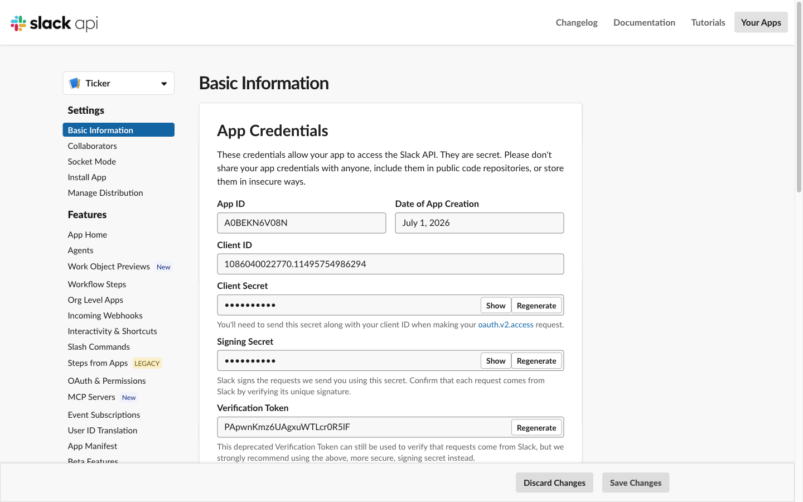
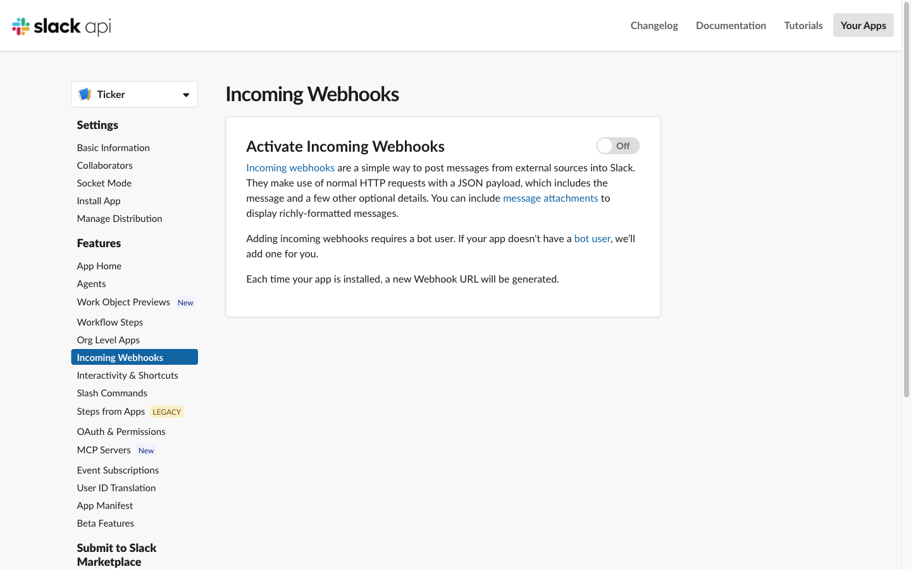
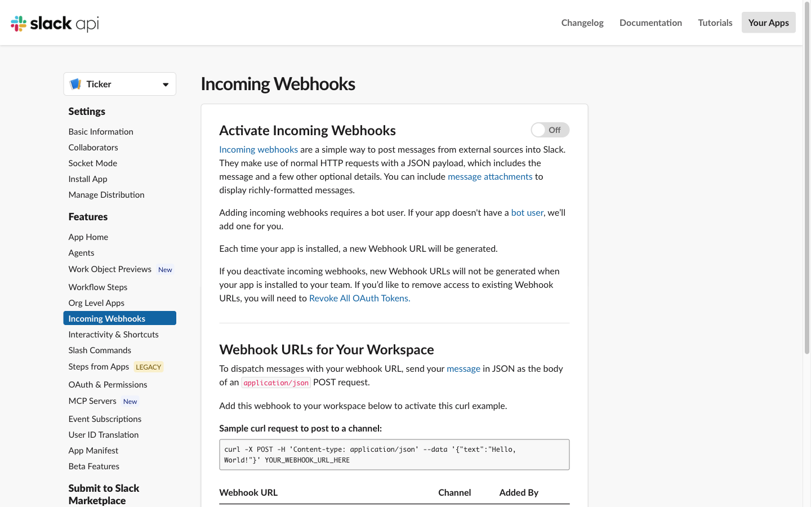
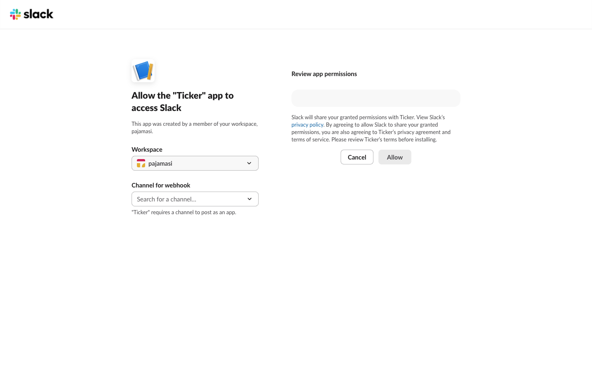
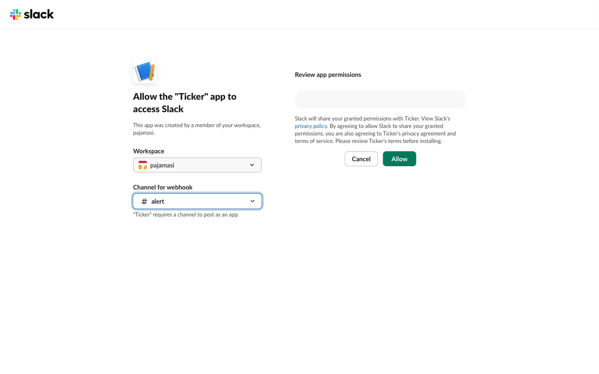
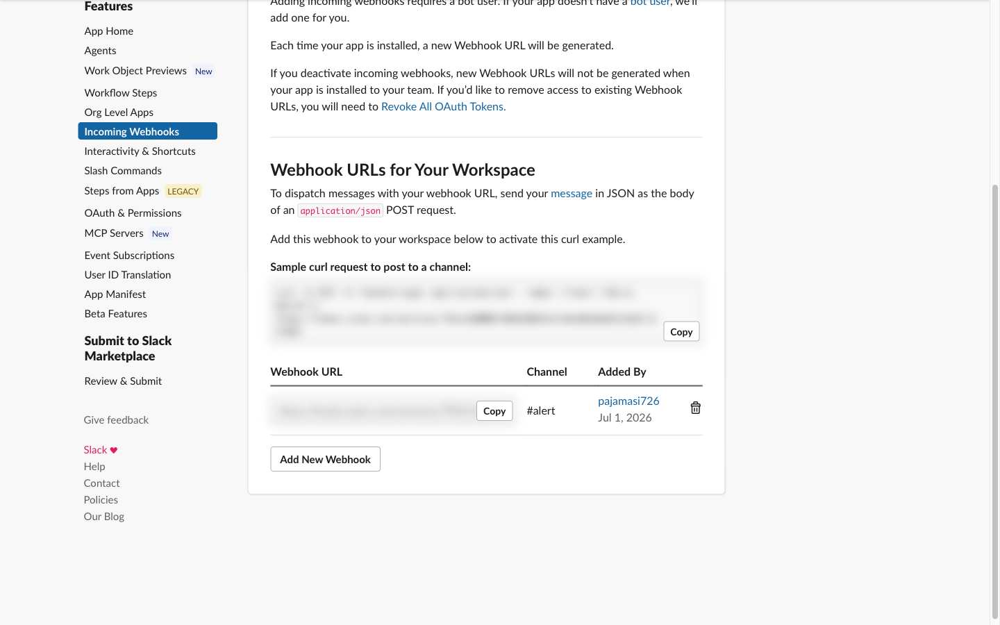

# Slack alerts — webhook setup & wiring

Ticker sends two kinds of alerts to one Slack **incoming webhook**: incident alerts
(🔴 DOWN / 🟢 recovered, debounced + cooldown) and metric-threshold alerts (⚠️, per-rule cooldown).
Multi-instance targets include the instance in the message, so you always know **which replica**:

```
🔴 *orders-api* [eb919f6499d7:8081] is DOWN
🟢 *orders-api* [eb919f6499d7:8081] recovered
⚠️ *orders-api [708884f1ecae:8081]* CPU (process) 86% exceeds 80% threshold
```

## 1. Create the webhook (one-time, ~2 minutes)

1. Open **https://api.slack.com/apps** (sign in) and click **Create New App**.

   

2. Choose **From scratch**.

   

3. Name it (e.g. `Ticker`), pick your workspace, **Create App**.

   

4. You land on the app's settings page.

   

5. In the left menu open **Incoming Webhooks** — it starts **Off**.

   

6. Flip **Activate Incoming Webhooks** to **On**, then click **Add New Webhook to Workspace**.

   

7. Slack asks which channel the app may post to.

   

8. Pick the channel (a dedicated `#alert`-style channel is ideal) and **Allow**.

   

9. Copy the generated **Webhook URL** (`https://hooks.slack.com/services/T…/B…/…`).

   

> **The URL is a credential** — anyone holding it can post to that channel. Keep it out of git,
> chat, and screenshots (the URL above is blurred for exactly that reason). If it ever leaks,
> revoke it on this same page (🗑) and add a new one.

## 2. Wire it into Ticker (env only — never a committed property)

```bash
# plain run / docker
export TICKER_ALERT_ENABLED=true
export TICKER_ALERT_SLACK_WEBHOOK_URL='https://hooks.slack.com/services/…'

docker run -d -p 8080:8080 \
  -e TICKER_ALERT_ENABLED=true \
  -e TICKER_ALERT_SLACK_WEBHOOK_URL="$(cat /path/to/slack-webhook)" \
  ticker:latest
```

```yaml
# kubernetes: put the URL in a Secret, not the manifest
env:
  - name: TICKER_ALERT_ENABLED
    value: "true"
  - name: TICKER_ALERT_SLACK_WEBHOOK_URL
    valueFrom:
      secretKeyRef: { name: ticker-alerts, key: slack-webhook-url }
```

No webhook set (with alerting enabled) → alerts are inert and the collector logs a single warning.
Related knobs: `ticker.alert.cooldown` (incident re-alert suppression, default 15m) and per-rule
`cooldownSeconds` / `forSeconds` on metric rules (editable in the UI's 🔔 popover or via
`PUT /api/alerts/rules/{key}`).

## 3. Verify end-to-end

1. **Webhook itself** — one curl, expect `ok` and a message in the channel:
   ```bash
   curl -X POST -H 'Content-Type: application/json' \
     -d '{"text":"Ticker webhook test"}' "$TICKER_ALERT_SLACK_WEBHOOK_URL"
   ```
2. **Incident path** — stop one monitored instance (`docker kill …` / `kubectl delete pod …`);
   after `failure-threshold × poll.interval` (default 3×10s) the 🔴 arrives with the instance
   label; start it again for the 🟢.
3. **Metric path** — temporarily drop a threshold so it must fire, then restore it:
   ```bash
   curl -X PUT -H 'Content-Type: application/json' \
     -d '{"threshold":0.001,"forSeconds":0}' http://<collector>/api/alerts/rules/cpu-process
   # …⚠️ arrives within ticker.alert.metric-interval…
   curl -X PUT -H 'Content-Type: application/json' \
     -d '{"threshold":0.80,"forSeconds":30}' http://<collector>/api/alerts/rules/cpu-process
   ```
   Recent fires are also visible without Slack at `GET /api/alerts/recent` and in the UI.

> Guardrail reminder: debounce + cooldown are deliberate — Ticker never alerts on a single failed
> poll, and repeated breaches are rate-limited so the channel stays readable.
